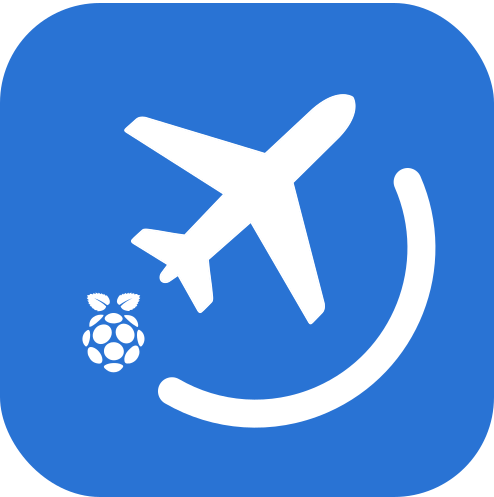

<div align="center">
  
  
  # PiPlane Tracker
  
  **Real-time aircraft monitoring system for Raspberry Pi**
  
  [](https://www.python.org/downloads/)
  [](LICENSE)
  [](https://www.raspberrypi.org/)
  [](https://github.com/flightaware/dump1090)
  
  Track aircrafts in real-time using ADS-B data with LCD/OLED display support. Get notified every time a new aircraft flies over your region.
  
  [Installation](#installation) • [Hardware](#hardware) • [Usage](#usage) • [Contributing](#contributing)
</div>

---

<div align="center">
  <table>
    <tr>
      <td align="center">
        📡
        <br><strong>Real-time Tracking</strong>
        <br>Monitor aircraft as they enter your coverage area
      </td>
      <td align="center">
        🖥️
        <br><strong>Multi-Display Support</strong>
        <br>LCD (16x2) and OLED (128x32) display compatibility
      </td>
      <td align="center">
        🔊
        <br><strong>Sound Alerts</strong>
        <br>Audio notifications for new aircraft detection
      </td>
    </tr>
  </table>
</div>

---

## Installation

### Prerequisites

- **Raspberry Pi** (3B+ or newer)
- **Python 3.7+**
- **dump1090-fa** (FlightAware ADS-B decoder)
- **RTL-SDR dongle** or similar ADS-B receiver

### Hardware Setup

- **LCD Display (16x2)**: Connect via I2C (SDA/SCL pins)
- **OLED Display (128x32)**: Connect via I2C (default address 0x3C)
- **RTL-SDR**: USB connection for ADS-B reception

### Configuration
- Edit the `config` to customize the behavior of the application

### Quick Start

1. **Clone the repository**
   ```bash
   git clone https://github.com/your-username/piplane-tracker.git
   cd piplane-tracker
   ```

2. **Install Python dependencies**
   ```bash
   pip install -r requirements
   ```

3. **Set up dump1090-fa** (if not already installed)
   ```bash
   sudo apt update
   sudo apt install dump1090-fa
   ```

4. **Configure your settings**
   ```bash
   nano config
   ```

5. **Run the tracker**
   ```bash
   python main.py
   ```

### Optional: Sound Alert Setup

For sound alerts, install additional audio packages:

```bash
# Install audio system tools
sudo apt update
sudo apt install mpg123
```

## Hardware

### Supported Hardware

| Component | Model                 | Notes                                  |
| --------- | --------------------- | -------------------------------------- |
| **SBC**   | Raspberry Pi 3B+ / 4B | Recommended for best performance       |
| **LCD**   | 16x2 I2C LCD          | HD44780 compatible                     |
| **OLED**  | 128x32 SSD1306        | I2C interface                          |
| **ADS-B** | RTL-SDR v3            | Or any dump1090-fa compatible receiver |

### Wiring Diagram

```
Raspberry Pi GPIO Layout:
                     
    3V3  (1) (2)  5V     
   GPIO2 (3) (4)  5V     ← LCD VCC
   GPIO3 (5) (6)  GND    ← LCD/OLED GND  
   GPIO4 (7) (8)  GPIO14
     GND (9) (10) GPIO15
  GPIO17 (11)(12) GPIO18
  GPIO27 (13)(14) GND
  GPIO22 (15)(16) GPIO23
    3V3 (17)(18) GPIO24
  GPIO10 (19)(20) GND
   GPIO9 (21)(22) GPIO25
  GPIO11 (23)(24) GPIO8
     GND (25)(26) GPIO7

I2C Connections:
- SDA: GPIO2 (Pin 3)  → LCD/OLED SDA
- SCL: GPIO3 (Pin 5)  → LCD/OLED SCL
- VCC: 5V (Pin 2/4)   → LCD VCC
- VCC: 3V3 (Pin 1)    → OLED VCC (3.3V)
- GND: GND (Pin 6)    → LCD/OLED GND
```

### I2C Device Detection

Verify your displays are detected:

```bash
sudo i2cdetect -y 1
```

Expected output:
```
     0  1  2  3  4  5  6  7  8  9  a  b  c  d  e  f
00:          -- -- -- -- -- -- -- -- -- -- -- -- -- 
10: -- -- -- -- -- -- -- -- -- -- -- -- -- -- -- -- 
20: -- -- -- -- -- -- -- 27 -- -- -- -- -- -- -- -- 
30: -- -- -- -- -- -- -- -- -- -- -- -- 3c -- -- -- 
40: -- -- -- -- -- -- -- -- -- -- -- -- -- -- -- -- 
50: -- -- -- -- -- -- -- -- -- -- -- -- -- -- -- -- 
60: -- -- -- -- -- -- -- -- -- -- -- -- -- -- -- -- 
70: -- -- -- -- -- -- -- --
```
- `27` = LCD Display (I2C address 0x27)
- `3c` = OLED Display (I2C address 0x3C)


## Usage

### Monitoring Mode

When you select **Monitor**, the system will display an interactive aircraft list that updates in real-time:

- **Navigation**: Enter the aircraft number (1, 2, 3, etc.) to view details
- **Details View**: Shows comprehensive aircraft information including:
  - Flight callsign and ICAO code
  - First and last seen timestamps
  - Duration tracked
  - Position history and coordinates
- **New Aircraft**: Newly detected aircraft show with a `[NEW]` tag
- **Refresh**: Press Enter to refresh the list
- **Exit**: Enter 'q' to quit monitoring mode

The list automatically updates as new aircraft are detected and removes aircraft that haven't been seen for 5 minutes.

## Contributing

Feel free to open an issue or PR.

## License

This project is licensed under the MIT License - see the [LICENSE](LICENSE) file for details.
